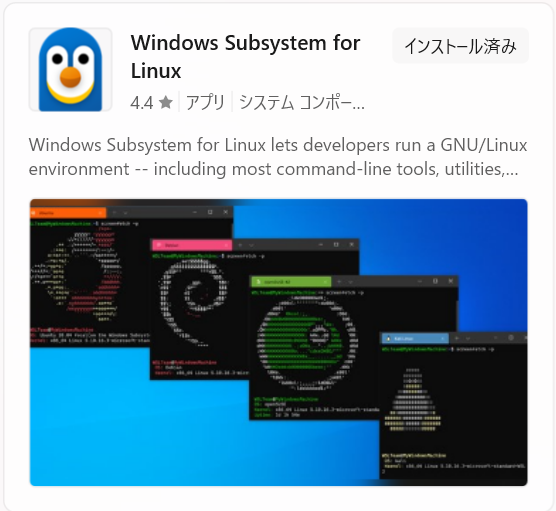
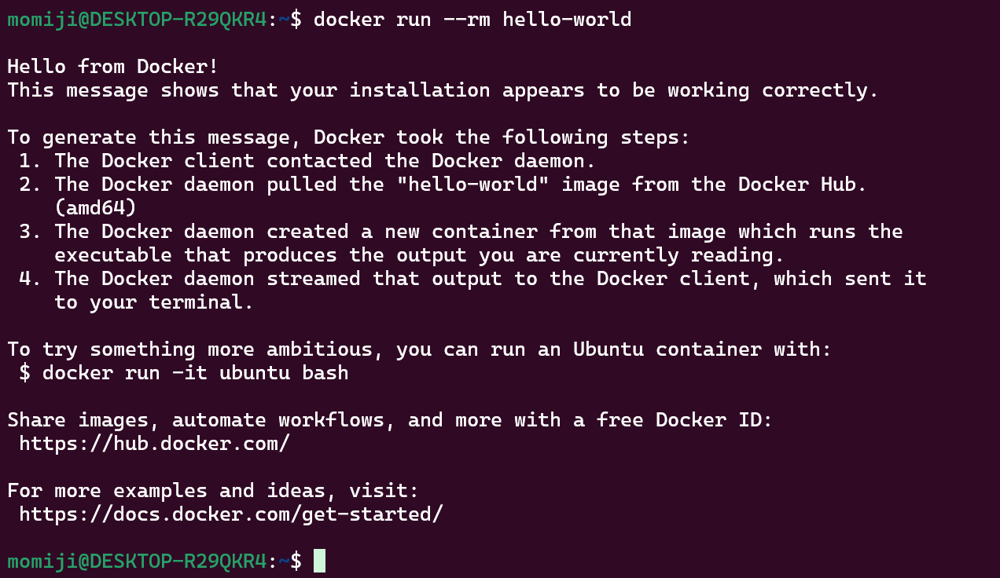

# intro_docker

## Getting Started with Docker

### 1. wslのアップデート
<!-- microsoft storeで`Windows Subsystem for Linux`と検索 -->
<!--  -->
PowerShellにて以下のコマンドを実行

```pwsh
wsl --update
```

### 2. docker ceのインストール
以下をwsl内で実行
```sh
curl -fsSL https://get.docker.com -o get-docker.sh
sudo sh get-docker.sh
sudo usermod -aG docker $USER
sudo sh -c 'echo "[boot]\nsystemd=true" > /etc/wsl.conf'
```

その後、wslのウィンドウを閉じ、PowerShellにて以下のコマンドを実行
```sh
wsl --shutdown
```

### 3. dockerの動作確認
再度wslを起動し、以下のコマンドを実行
```sh
docker run --rm hello-world
```

<!--  -->


## Containers using Dev Containers with vscode

基本的には以下のようなディレクトリの構成で運用

```
.
├── .devcontainer/
│   ├── devcontainer.json
│   └── Dockerfile
├── project_directory/
│   ├── lib/
│   └── main.py
└── README.py
```

### devcontainers.json

```json
{
	"name": "python 3.11",
	"build": { "dockerfile": "Dockerfile" },
	"runArgs": ["--init", "--name", "py_workbench"],
	"customizations": {
		"vscode": {
			"settings": {
                "diffEditor.ignoreTrimWhitespace": false,
				"explorer.openEditors.visible": 0,
                "files.insertFinalNewline": true,
                "files.trimTrailingWhitespace": true,
				"markdown-preview-enhanced.scrollSync": false
				// "notebook.lineNumbers": "on"
			},
			"extensions": [
				"oderwat.indent-rainbow",
				"yzhang.markdown-all-in-one",
				"yzane.markdown-pdf",
				"shd101wyy.markdown-preview-enhanced",
				"donjayamanne.python-extension-pack"
				// "ms-toolsai.jupyter",
			]
	  	}
	}
}
```

### Dockerfile

```Dockerfile
FROM python:3.11-bullseye
USER root

ENV DEBIAN_FRONTEND=noninteractive

RUN apt-get update && \
    apt-get install -y --no-install-recommends \
    python3-tk && \
    apt-get -y clean && \
    rm -rf /var/lib/apt/lists/*

RUN python -m pip install --upgrade pip
RUN python -m pip install numpy scikit-learn matplotlib
```
