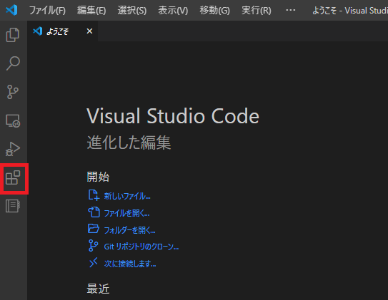
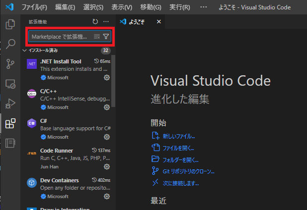
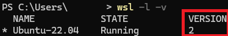

# WSL

## wslとは？

Windows Subsystem for Linuxの略でWindows上で動作するLinux

## wslのセットアップ

### 1. 必要なソフトのインストール
- [VSCode](https://code.visualstudio.com/download)[^vscode]
  - wslやdockerを操作可能な統合開発環境
- [Windows Terminal](https://apps.microsoft.com/detail/9n0dx20hk701?hl=ja-jp&gl=JP)
  - PowerShellやWSLを同一のウィンドウでタブとして操作可能
### 2. vscodeに拡張機能を追加

以下の3つの拡張機能をvscodeにインストールする

| 拡張機能名 | 拡張機能ID | 備考 |
|:----------|:-----------|:-----|
| Japanese Language Pack for Visual Studio Code | MS-CEINTL.vscode-language-pack-ja | vscodeの日本語化 |
| WSL | ms-vscode-remote.remote-wsl | vscodeでwslにアクセス |
| Dev Containers | ms-vscode-remote.remote-containers | vscodeでDockerコンテナを使用 |


赤枠の部分をクリックしダイアログ（2枚目赤枠）で検索してインストールできる






#### Japanese Language Pack for Visual Studio Codeの日本語化方法
1. vscode上で`Ctrl+Shift+P`を押して、出てきたコマンドパレットにて`Configure Display Language`と入力
2. 出てきた`Configure Display Language`コマンドを選択
3. 日本語を選択


### 3. Windows Terminalに管理者モードのPowerShellを追加
1. タブ表示部の下向きの「＞」から設定を開き、「新しいプロファイルを追加します」を選択
    

2. プロファイルを複製する　で「Windows PowerShell」を選択し複製
    
3. 名前を「Windows PowerShell (コピー)」から「Windows PowerShell (管理者)」に変更
4. 「このプロファイルを管理者として実行する」をオンにする
    
5. 保存して設定を閉じる


### 4. 仮想環境を使えるようにする(Hyper-Vの有効化)
1. PowerShellを管理者として実行
   - 先ほど作成した「Windows PowerShell (管理者)」を選択
2. 以下の2行のコマンドを実行
    ```pwsh
    dism.exe /online /enable-feature /featurename:Microsoft-Windows-Subsystem-Linux /all /norestart
    dism.exe /online /enable-feature /featurename:VirtualMachinePlatform /all
    ```
3. 表示に従って「Y」を入力する
   - 自動的にPCが再起動される


### 5. wslのセットアップ
1. PowerShellを開き以下のコマンドを実行
    ```pwsh
    wsl --update
    ```
2. ディストリビューションの追加 PowerShell上で以下のコマンドを実行
    ```pwsh
    wsl --install -d Ubuntu-22.04
    ```
3. 画面の指示に従ってusername, passwordを入力
    - passwordは画面に表示されないが、入力はされていることに注意
4. PowerShell上で`wsl -l -v`と実行し、VERSIONが2になっていることを確認する
    

[^vscode]: 「[Codeで開く]アクションを追加する」を選択するとディレクトリやファイルを右クリックでvscode上でアクセス可能
